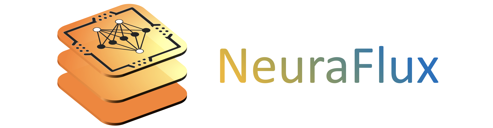
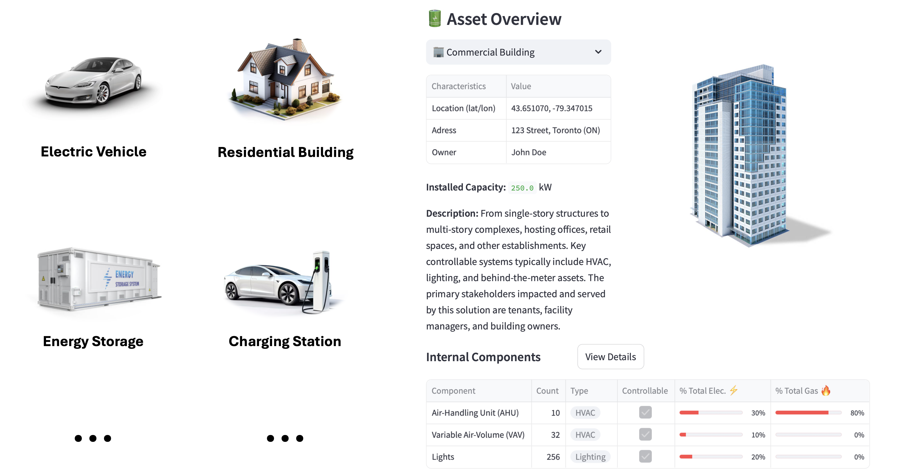
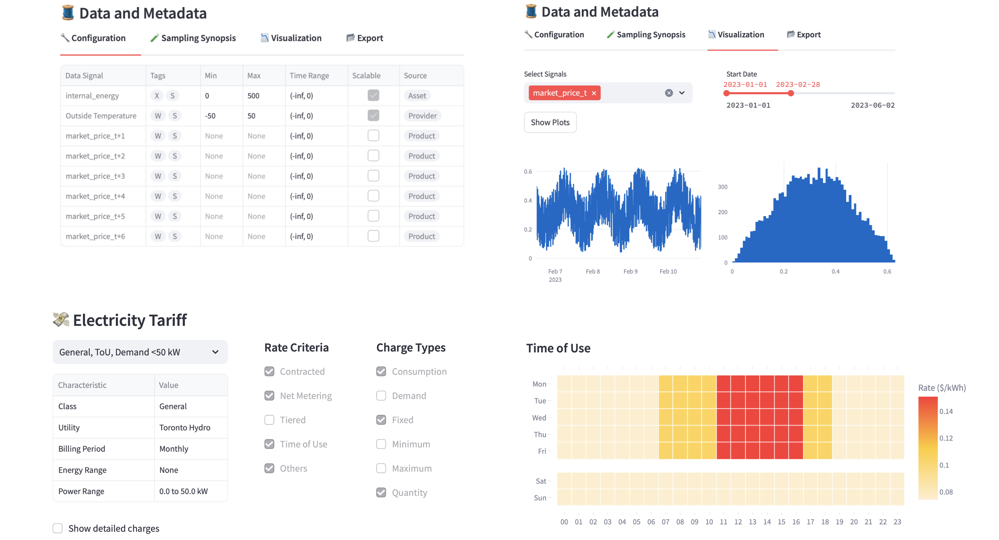
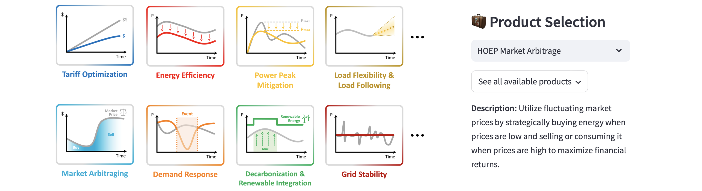
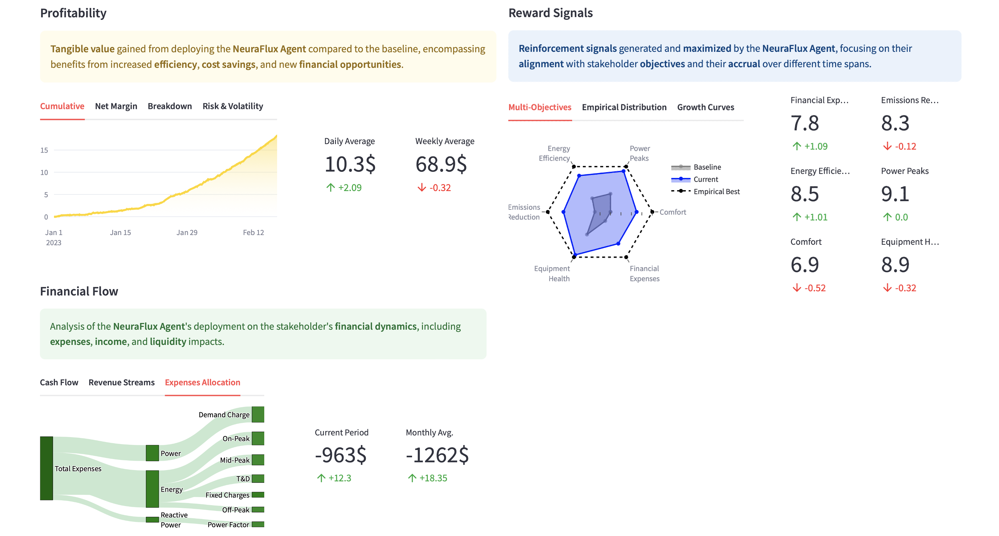
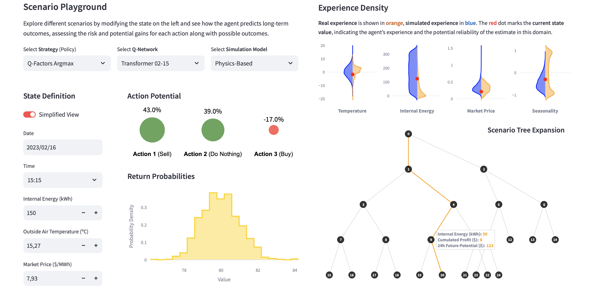
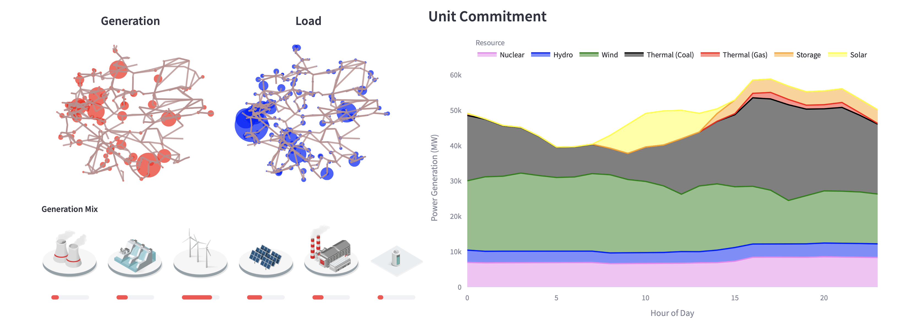
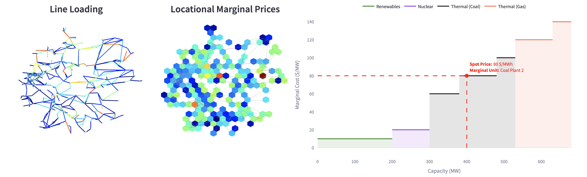

# NeuraFlux



**NeuraFlux** is a scalable and adaptive framework for data-driven multi-agent power optimization in smart grid environments. Leveraging deep reinforcement learning, NeuraFlux offers advanced and customized real-time decision-making capabilities. The framework's modular and scalable design facilitates seamless integration with various electrical assets and consumer-level devices, accommodating diverse stakeholder requirements.

## Table of Contents
- [Installation](#installation)
- [Overview](#overview)
  - [1. Empowering Energy Assets](#empowering-energy-assets)
  - [2. Data-Driven Intelligence](#data-driven-intelligence)
  - [3. Tailored Optimization](#tailored-optimization)
  - [4. Profitable by Design](#profitable-by-design)
  - [5. Strategy & Control Unleashed](#strategy--control-unleashed)
  - [6. Energy Grid Awareness and Impact](#energy-grid-awareness-and-impact)
  - [7. From Energy Flow to Economic Value](#from-energy-flow-to-economic-value)
- [Getting Started](#getting-started)
- [Case Studies](#case-studies)
  - [Commercial Building HVAC Systems](#commercial-building-hvac-systems)
  - [Energy Storage Arbitraging](#energy-storage-arbitraging)
  - [Industrial Process Optimization](#industrial-process-optimization)
  - [Electric Vehicle Grid Contribution](#electric-vehicle-grid-contribution)
  - [NeuraFlux v1.X Case Studies](#neuraflux-v1x-case-studies)
- [Documentation](#documentation)
- [License](#license)

## Installation

To get started with NeuraFlux, follow these simple steps:

1. **Clone the Repository:**

   First, clone the NeuraFlux repository to the desired machine:

   ```bash
   git clone https://github.com/yourusername/neuraflux.git
   ```

2. **Install Dependencies with Poetry**
    The package uses **Poetry** to manage dependencies and virtual environments. If you haven't installed Poetry yet, installation steps can be found [here](https://python-poetry.org/docs/).

    Once Poetry is installed, move to the project directory and run

    ```bash
    poetry install
    ```

    to install all project dependencies.

3. **Docker Deployment**
    The package features and components will soon be dockerized, allowing them to run seamlessly in a containerized environment.

## Overview

### 1. Empowering Energy Assets

NeuraFlux integrates with Distributed Energy Resources (DERs), enabling bespoke control and adaptive learning tailored to each asset's unique characteristics.



### 2. Data-Driven Intelligence
Centralizing data from multiple sources - including asset sensors, various providers, and detailed tariff rate structures - empowers informed decision-making and continuous adaptation to dynamic energy environments.



### 3. Tailored Optimization
Product definition and selection empower stakeholders to define a wide array of optimization objectives, allowing asset owners to choose from a rich and diverse ecosystem of opportunities.



### 4. Profitable by Design
Built on a deep reinforcement learning foundation, Neuraflux ensures powerful alignment with diverse objectives and risk profiles. By maximizing reward signals and supporting advanced control methodologies, it consistently drives profitability and financial performance.



### 5. Strategy & Control Unleashed
The decision engine supports multiple strategies, dynamically switching between them. By simulating policies across hypothetical scenarios, NeuraFlux builds a global understanding of performance. It also leverages scenario trees and predictive models, ensuring robust and forward-thinking control in complex environments.



### 6. Energy Grid Awareness and Impact
NeuraFlux adapts to grid conditions with the power to influence consumption profiles and generation mix. By integrating unit commitment and dispatch data, it optimizes energy usage patterns and influences grid operations, ensuring a balanced and efficient power system.



### 7. From Energy Flow to Economic Value
Neuraflux’s capabilities encompass market mechanisms and economic factors, such as Locational Marginal Prices (LMPs). By integrating these signals, NeuraFlux optimizes both energy distribution and financial outcomes, ensuring that energy resources are utilized efficiently and profitably in response to dynamic market conditions.



## Getting Started

To be completed.

## Case Studies

To be completed.

  ### Commercial Building HVAC Systems

  To be completed.
### Energy Storage Arbitraging

To be completed.
### Industrial Process Optimization

To be completed.
### Electric Vehicle Grid Contribution

To be completed.
### NeuraFlux v1.X Case Studies

The code and visualizations presented in the article *NeuraFlux: A Scalable and Adaptive Framework for Autonomous Data-Driven Multi-Agent Power Optimization* are available at the [following link](https://github.com/YsaelDesage/NeuraFlux), under commit version *7a28c5a*.

## Documentation

To be completed.

## License

This project is licensed under the GNU General Public License v3.0. The full text of the license can be found in the LICENSE file.