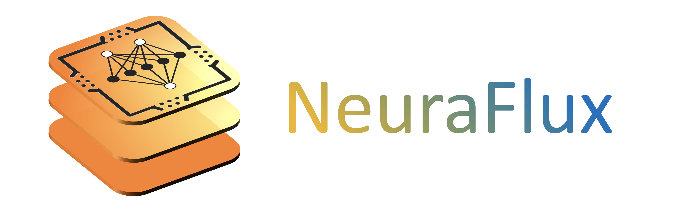
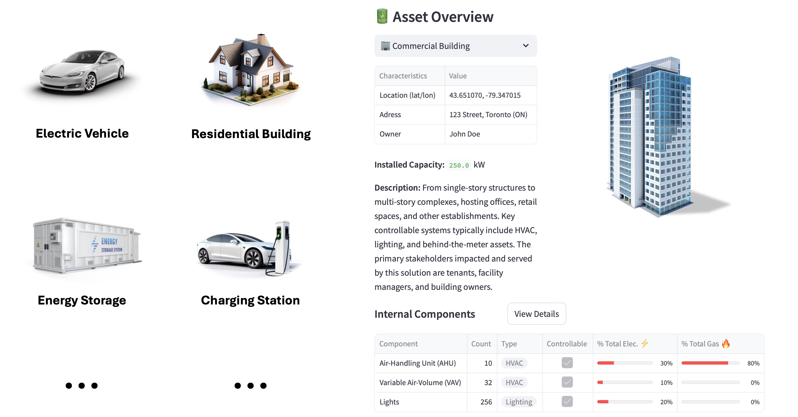
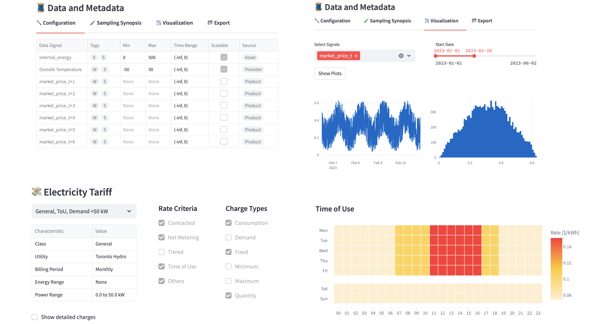
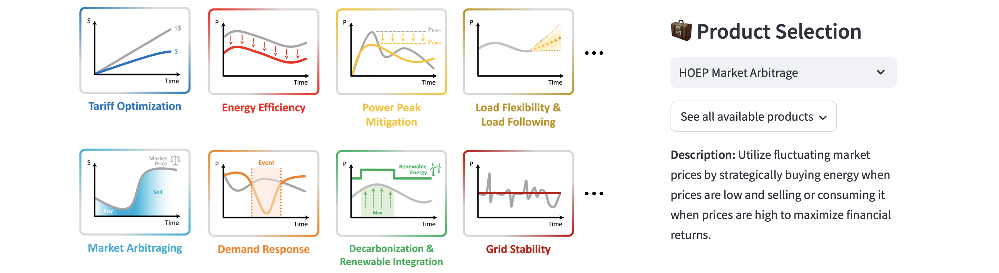
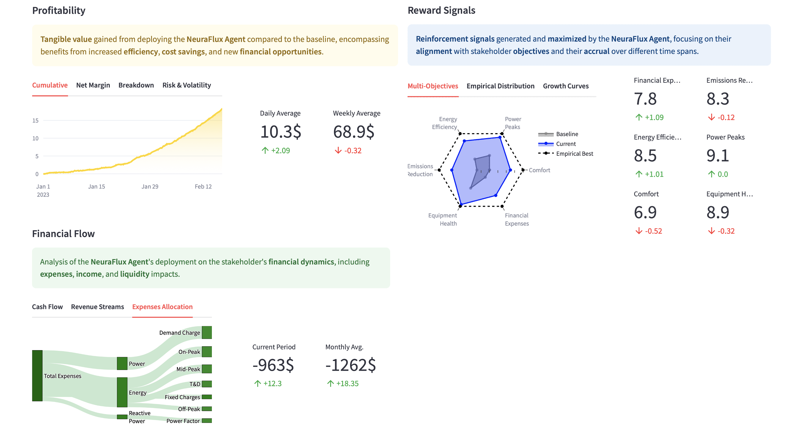

# NeuraFlux



**NeuraFlux** is a scalable and adaptive framework for data-driven multi-agent power optimization in smart grid environments. Leveraging deep reinforcement learning, NeuraFlux offers advanced and customized real-time decision-making capabilities. The framework's modular and scalable design facilitates seamless integration with various electrical assets and consumer-level devices, accommodating diverse stakeholder requirements.

## Table of Contents
- [Installation](#installation)
- [Overview](#overview)
  - [1. Empowering Energy Assets](#empowering-energy-assets)
  - [2. Data-Driven Intelligence](#data-driven-intelligence)
  - [3. Tailored Optimization](#tailored-optimization)
  - [4. Profitable by Design](#profitable-by-design)
- [Getting Started](#getting-started)
- [Simulation Artifacts](#simulation-artifacts)
- [License](#license)

## Installation

NeuraFlux is **library-first**: you construct a `SimulationConfig` in Python and run a simulation to produce reproducible artifacts.

Prerequisites:
- Python `3.11`
- [Poetry](https://python-poetry.org/docs/)

- **Step 1: Clone the Repository**

  First, clone the NeuraFlux repository to the desired machine:

    ```bash
    git clone https://github.com/YsaelDesage/NeuraFlux.git
    cd NeuraFlux
    ```

- **Step 2A: Local Install with Poetry**

  Install dependencies:

    ```bash
    poetry install
    ```

  Run a small simulation example (recommended for a quick sanity check):

    ```bash
    poetry run python examples/simulations/run_sim_energy_storage.py
    ```

- **Step 2B: Docker Deployment**

    Optional (dashboard development): build and run the Streamlit UI in Docker.

    - **Build the Docker Image**: Build the Docker image from the Dockerfile located at the root of the project directory:

      ```bash
      docker build -t neuraview-app .
      ```

    - **Run the Docker container**: Once the image is built, you can run NeuraFlux's dashboard using:

      ```bash
      docker run -p 8501:8501 neuraview-app
      ```

    This command maps port 8501 of the container to port 8501 on your host, allowing you to access the Streamlit application via http://localhost:8501.

    

## Overview

### 1. Empowering Energy Assets

NeuraFlux integrates with Distributed Energy Resources (DERs), enabling bespoke control and adaptive learning tailored to each asset's unique characteristics.



### 2. Data-Driven Intelligence
Centralizing data from multiple sources - including asset sensors, various providers, and detailed tariff rate structures - empowers informed decision-making and continuous adaptation to dynamic energy environments.



### 3. Tailored Optimization
Product definition and selection empower stakeholders to define a wide array of optimization objectives, allowing asset owners to choose from a rich and diverse ecosystem of opportunities.



### 4. Profitable by Design
Built on a deep reinforcement learning foundation, Neuraflux ensures powerful alignment with diverse objectives and risk profiles. By maximizing reward signals and supporting advanced control methodologies, it consistently drives profitability and financial performance.



## Getting Started

Run from the repo root (see `examples/simulations/README.md`):

```bash
poetry run python examples/simulations/run_sim_energy_storage.py
poetry run python examples/simulations/run_sim_commercial_building.py
```

Both example scripts are **constant-config**: edit the constants at the top of the file (e.g. number of days, seed, output root, and whether learning is enabled) and re-run.
If you want to avoid any weather re-downloads, set `WEATHER_DB_SOURCE` in the example script to point to an existing `weather.db` (or a previous run directory containing one).

To launch a simulation programmatically, build a `SimulationConfig` and run it:

```python
from neuraflux.runner import run_simulation
from neuraflux.schemas.simulation import SimulationConfig

config = SimulationConfig(...)  # build config in Python
result = run_simulation(config)
print(result.directory)
```

The longer case study scripts are available as end-to-end references (they may take longer to run):
- `main_run_case_study_1.py`
- `main_run_case_study_2.py`

To launch **NeuraView** (optional), run:

```bash
poetry run streamlit run neuraview/main.py
```

## Simulation Artifacts

Each simulation run writes a self-contained artifacts directory under the configured output directory (for the examples: `simulations/examples/.../<run_id>/`).

Downstream analysis (e.g. dashboards) can rely on these artifacts being present:
- `config.json` (full simulation config)
- `sim_summary.json` (run status + summary)
- `time_ref.json` (time reference used by the simulation)
- `metrics.json` (rollup metrics for real vs shadow/baseline trajectories)
- `logs.db` (sqlite logs)
- `agent.pkl` (pickled agent state)
- `training_summary.json` (per-agent training counters/timestamps)
- per-agent parquet data under `data/` (timestep records) and, if enabled, simulated training data under `sim_data/`


## Case Studies

To be completed.

### NeuraFlux v1.X Case Studies

The code and visualizations presented in the article *NeuraFlux: A Scalable and Adaptive Framework for Autonomous Data-Driven Multi-Agent Power Optimization* are available at the [following link](https://github.com/YsaelDesage/NeuraFlux), under commit version *7a28c5a*.

## License

This project is licensed under the Apache License v2.0. The full text of the license can be found in the LICENSE file.
